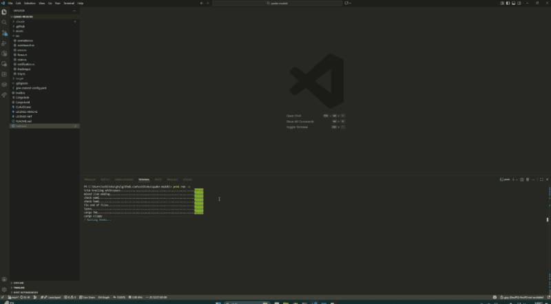

# Quake Modoki



Windows utility enabling Quake Mode behavior—any window slides in/out from screen edge via global hotkey.

## Requirements

- Windows 10/11 (64-bit)

## Installation

```bash
cargo install quake-modoki --locked
```

## Usage

| Hotkey | Action |
|--------|--------|
| `Ctrl+Alt+Q` | Track current window |
| `F8` | Toggle window visibility |

Tray icon menu: Untrack / Start with Windows / Exit

## Development

### Pre-commit Hooks

```bash
# prek install
cargo install --locked prek

# enable hooks
prek install
```

Hooks: `cargo fmt`, `cargo clippy`, `typos`, `trailing-whitespace`, etc.

## Made with

- Icon: Nano Banana Pro (Gemini 3 Pro Image Preview)
- Code: [Claude Code](https://claude.ai/code)

## License

MIT OR Apache-2.0
